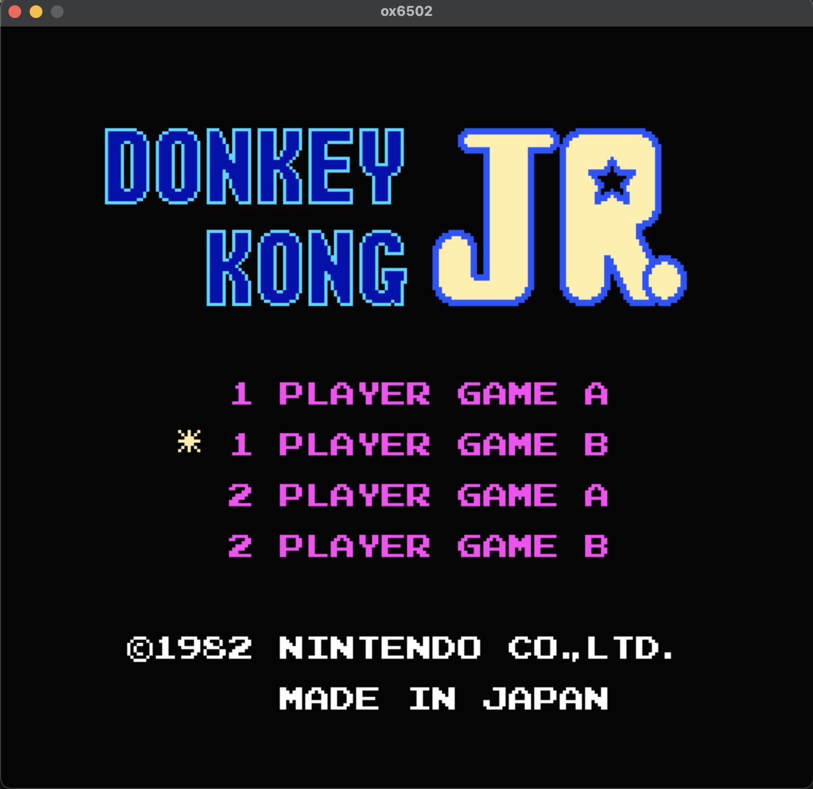
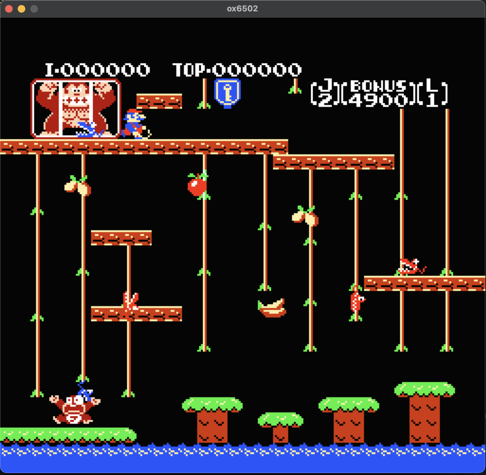

# ox6502

MOS 6502 / CMOS W65C02 CPU emulator with NES system emulation, written in Rust.


 

## Features

- **CPU**: Full 6502/65C02 instruction set, 247/256 NMOS illegal opcodes (SST 96.5%), all 13 addressing modes, page-crossing cycle penalties, interactive debugger
- **NES PPU**: Background + sprite rendering, loopy address system, OAM DMA, NMI timing
- **NES APU**: Pulse 1/2, Triangle, Noise channels with frame counter and audio output
- **Mappers**: NROM (0), MMC1 (1)
- **Input**: Keyboard → NES joypad mapping
- **Display**: SDL2 real-time window (3x) or offline PPM renderer

## Usage

```bash
cargo build

# CPU test ROMs
cargo run -- tests/roms/6502_functional_test.bin
cargo run -- tests/roms/6502_functional_test.bin --debug

# NES games (requires SDL2: brew install sdl2)
cargo run --bin nes_sdl -- <game.nes>
cargo run --bin nes_render -- <game.nes> [frames]
```

## Keyboard Controls

| Key | NES Button |
|-----|------------|
| A | A |
| S | B |
| Backspace | Select |
| Enter | Start |
| ↑ ↓ ← → | D-Pad |
| Esc | Quit |

## Monitor Commands

`s` step · `c` continue · `r` regs · `d [addr] [n]` disassemble · `m [addr] [len]` memory · `b <addr>` breakpoint · `bc <id>` clear · `bl` list · `t [n]` trace · `h` help · `q` quit

## SST Results

247/256 opcodes pass (96.5%). 9 remaining are unstable opcodes with behavior varying by CPU revision.

## References

- [W65C02S Datasheet](https://www.westerndesigncenter.com/wdc/documentation/w65c02s.pdf)
- [6502 Functional Tests](https://github.com/Klaus2m5/6502_65C02_functional_tests)
- [NES Dev Wiki](https://www.nesdev.org/wiki/Nesdev_Wiki)

## License

MIT
